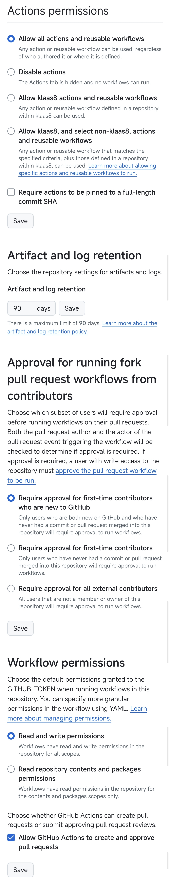

## MT论坛自动签到脚本

这是一个用于自动签到 [MT论坛](https://bbs.binmt.cc) 的脚本，配合 GitHub Actions 实现自动定时执行。

> 本项目 fork 自 [klaas8/MT](https://github.com/klaas8/MT)，并针对 **2025-10 论坛上线阿里云 WAF 后签到失效**的问题做了修复。

---


## 功能

- 🔐 自动签到（单账户或多账户）
- 👥 支持多账户批量处理
- ⏰ 每天自动执行签到（UTC 0:00 / 北京时间 8:00，以及 UTC 12:00 / 20:00）
- 🛡️ **突破阿里云 WAF `acw_sc__v2` JS 反爬挑战**
- 🔁 **代理失效时自动直连兜底**
- 📲 **签到结果推送到微信**（Server酱，可选）
- 🚨 **签到失败会返回非 0 退出码**（不再出现"假绿"）

---

## 🛡️ WAF 修复说明

### 问题背景

2025 年 9 月底，MT 论坛接入阿里云 ESA WAF。此后服务器不再直接返回登录页，而是返回一段**混淆 JavaScript 挑战页**：

```html
<html><script>var arg1='E1882740088B4C542FBF7BF375E4CFCECAA898A6';
... 混淆代码 ...
document.cookie='acw_sc__v2='+v+...;document.location.reload();
</script></html>
```

原脚本因为解析不到 `formhash`，只能打印空警告后静默失败。

### 解决方案

补丁在 `main.py` 中加入了 `acw_*` 系列函数，自动完成"识别 → 解算 → 重试"：

| 函数 | 作用 |
|---|---|
| `acw_decode` | 解码 obfuscator.io 自定义 base64 字符串 |
| `acw_key` | **动态**从混淆 JS 的数组中提取 40 位 XOR 密钥（含常量兜底） |
| `acw_solve` | 还原排列 + 异或运算，算出 `acw_sc__v2` cookie |
| `acw_need` | 精准识别挑战页（含 `acw_sc__v2` + `arg1='` + 长度 < 20KB） |
| `acw_get` / `acw_post` | 请求包装器，命中挑战则自动重试一次 |

### 算法还原

```
1. 排列还原   for x in 0..39: for z in 0..39: if arr[z]==x+1: q[z]=arg1[x]
2. 异或计算   res[i] = hex(q[i]) XOR hex(key[i])
3. 写入 Cookie  acw_sc__v2=res; max-age=3600; path=/
```

密钥从混淆数组中动态提取（`[34]` 项解码后即 40 位 HEX），**即使官方轮换密钥也无需改代码**。

### 实测效果

```
00:47:03  可用ip代理:
00:47:03  开始签到
00:47:04  WAF KEY 动态提取成功
00:47:04  WAF 挑战已破解, 重新请求
00:47:06  已签到              ← 成功
00:47:06  签到成功
00:47:08  数据库已更新
```

---

## 使用方法

1. fork 或上传此项目。
2. 在 Actions 菜单允许 `I understand my workflows, go ahead and enable them` 按钮
3. 在 GitHub 仓库的 `Settings → Secrets and variables → Actions` 中添加以下 Secrets
   - 添加账号：变量名 `ACCOUNTS`
     **单账号格式：**
     ```
     user:pass
     ```
     **多账号格式：**
     ```
     user1:pass1
     user2:pass2
     user3:pass3
     ```
   - （可选）微信推送：变量名 `SERVER`
     前往 [Server酱官网](https://sct.ftqq.com/) 微信扫码登录，在「SendKey」页复制以 `SCT` 开头的 Key，添加为名为 `SERVER` 的 Secret
     > 不配置也能正常签到，只是不会收到微信推送
5. 在 GitHub 仓库的 `Settings → Actions → General` 设置允许推送权限
6. GitHub Actions 初始手动执行检查是否有配置错误，脚本会自动每天执行，可手动执行

<p align="center">可以按照下面教程设置</p>

## 操作教程

### 设置变量
>1. 步骤一
>   
>2. 步骤二
>   
>3. 步骤三
>   
>4. 步骤四
>   

### 设置权限
>1. 步骤一
>   
>2. 步骤二
>   
>3. 步骤三
>   
>4. 步骤四
>   

### 运行测试
>1. 步骤一
>   
>2. 步骤二
>   
>3. 步骤三
>   
>4. 步骤四
>   
>5. 步骤五
>   

---

## 注意事项

1. 确保账户密码正确
2. 首次运行 GitHub Actions 需要授权
3. 脚本执行时间为 UTC 0:00（香港时间 8:00）
4. **如果 Workflow 显示红色 ❌，说明签到确实失败了**（这是修复后的特性，以前失败也会显示绿色）

---

## 📋 更新日志

### 2026-10-07 — 存储/推送优化
- 🗃️ 签到记录键由用户名改为 MD5 摘要，修复中文用户名在 MySQL/SQLite 下的键长度限制崩溃
- 🚫 WAF 挑战页/代理失败页不再被误记为"已签到"（新增响应排除名单并清理误杀条目）
- 📲 新增 Server酱微信推送（成功/失败均推送，Secret 未配置时自动跳过）
- 🧹 清理数据库中停用账户的历史残留记录

### 2026-10-06 — WAF 修复版
- 🛡️ 新增阿里云 WAF `acw_sc__v2` 挑战破解（`acw_*` 函数族）
- 🔑 支持从混淆 JS 动态提取 XOR 密钥，不硬编码
- 🔁 `checkIn()` 支持直连模式，代理全挂时自动兜底
- 🚨 签到失败返回非 0 退出码，杜绝"假绿"
- 📝 失败日志改为输出响应片段，便于排查

### 上游版本
- 2026-02-17 更新 `checkin.yml`
- 2026-08-29 更新 `main.py`（用户名脱敏）

---

## 🔗 相关链接

[个人主页，点点关注](https://bbs.binmt.cc/home.php?mod=space&do=profile&mycenter=1)

###### **最后更新日期：2026年10月07日 02点31分**


## 许可证

GPL 3.0